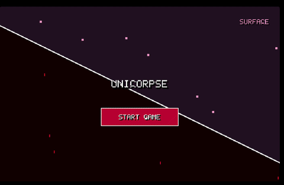
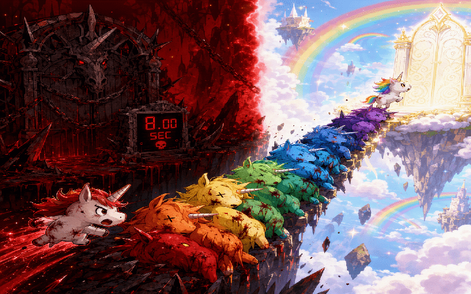
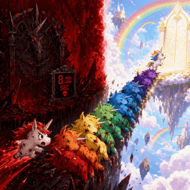
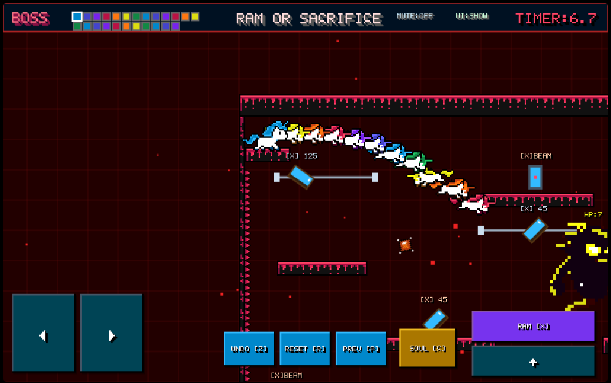
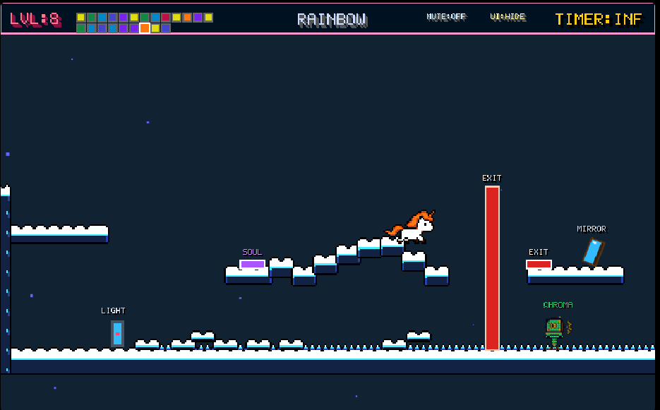

# Unicorpse (JS13kgames-2026)

> **Theme**: Unicorn and Rainbow  
> **Category**: Desktop & Mobile HTML5 Game (Strictly ≤ 13KB ZIP)  
> **Tagline**: Forge the Rainbow Bridge with blood, bone, and starlight.

---

### Gameplay Preview

|  |  |
| :-: | :-: |
| **Cover (800 × 500)** | **Thumbnail (320 × 320)** |
|  |  |
| **Blood Realm (Inside / 8.0s Decay)** | **Pastel World (Surface)** |
> Thumbnail/Cover Image generated by AI (Microsoft Designer)
> prompt: High-contrast 2D fantasy game concept art, split dimension. Left side: dark Blood Realm with jagged obsidian cliffs, blood cascades, a stone demon gate, and a glowing red digital timer reading "8.00 SEC". Right side: dreamy pastel heaven with floating castle islands, vibrant rainbow arches, and a glowing golden gate. Bridging the dark abyss is a diagonal staircase of seven cute sacrificed unicorns in rainbow order (red, orange, yellow, green, blue, indigo, violet). A determined white unicorn runs up from the left; a tiny rainbow unicorn enters the golden portal. Dramatic volumetric lighting, sharp focus, vibrant contrast.
---

## 📖 About This Game
**Unicorpse** is a 2D dual-dimension puzzle platformer engineered from the ground up for **JS13K 2026** under the competition theme **"Unicorn and Rainbow"**.

### 📖 World & Narrative Overview

> *"In a world shattered by dimensional rifts, mortal unicorns face impossible abysses and monstrous threats. Lacking divine powers, they rely on pure devotion—and seven spectral souls."* 
> When all paths collapse, a pioneer unicorn willingly steps into the terrifying **Blood Realm** to pave the way. In its final **8.0 seconds**, it violently rams sheer cliffs—permanently pinning its horn and corpse into stone as a climbable ladder—or anchors its soul in the **Pastel World** as an ethereal cloud platform to hold heavy pressure switches.
> **Red to Violet**, seven fallen ancestors leave an interlocked path of corpses across the void. The living tread directly upon the stiffened spines of their predecessors, redirecting prismatic laser beams through ancient mirrors to annihilate nightmarish abominations and lead the herd to the Golden Gate.

---

## 🎮 Core Features & Mechanics

### 1. Dual-Dimension Dynamics
* **🌸 Pastel World (Surface Realm)**:
  * Peaceful sanctuary with no countdown timer (`TIMER: INF`).
  * Press **`SOUL [C]`** to release an ethereal spirit, leaving a permanent **Cloud Platform** or locking down purple `SOUL` switches.
  * The only dimension where the **EXIT Portal** can be activated and traversed.
* **🩸 Blood Realm (Upside down)**:
  * A brutal **8.0-second life decay timer** triggers upon entry.
  * Press **`RAM [X]`** to execute a violent forward charge:
    * **Wall Pin**: Ram sheer cliffs to embed the horn, turning the body into a permanent **Pinned Ladder**.
    * **Optic Strike**: Strike kinetic mirrors to adjust angles and fire high-energy prismatic beams.

### 2. The 7 Color Unicorns
* In Boss level Successive pioneers cycle through the 7 spectral wavelengths:
  `🔴 Red` ➔ `🟠 Orange` ➔ `🟡 Yellow` ➔ `🟢 Green` ➔ `🔵 Blue` ➔ `🟣 Indigo` ➔ `🟪 Violet`.
* Each corpse serves as both physical stepping stone and optical prism to solve multi-stage chromatic puzzles.

### 3. Monsters & Boss Encounters
* **Type 1 (Nightmare Ghost)**: Lurks within abyssal fog, lunging forward with shadow claws.
* **Type 2 (Ranged Patrol)**: Mechanical patrol turret firing lethal diamond-shaped energy projectiles.
* **Type 3 (Color Jumper)**: Bouncing vertical sentry guarding high-altitude switches.
* **Type 4 (Seven-Phase Core Boss)**: Massive multi-eyed colossus protected by 7 shifting chromatic barrier shields.

---

## 🕹️ Controls
### Desktop Keyboard
| Key | Action | Description |
| :--- | :--- | :--- |
| **`←` `→`**  | Move | Run left and right |
| **`↑`**  **`Space`** | Jump | Leap across platforms and corpses |
| **`X`** | Ram / Shift | Switch dimension on surface; Charge / Wall-pin in Blood Realm |
| **`C`** | Soul Sacrifice | Sacrifice current form to create a Cloud Platform / Hold switch |
| **`Z`** | Undo | Rewind the last fallen corpse and restore soul queue |
| **`R`** | Reset | Instant-restart current puzzle chamber |
| **`P`** | Prev Level | Jump back to previous completed chamber |

## 👥 Credits & Thanks
* **JS13K Games**: Thanks to [Andrzej Mazur](https://end3r.com/) and the community for hosting the competition.
* **Google Gemini**: For generative AI co-authoring, code architecture optimization (~50%), and documentation structuring.
* **Microsoft AI (Designer )**: For concept Cover/Thumbnail, key visual prototyping.
* Dedicated to all puzzle-platformer speedrunners and pixel-art enthusiasts!